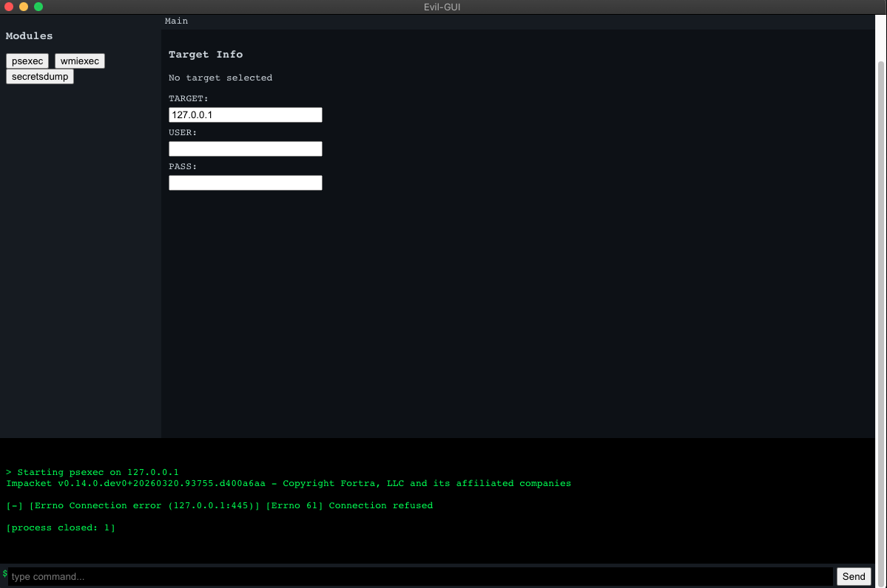

## Installation

### 1. Clone the repository

```bash
git clone https://github.com/your-username/evil-gui.git
cd evil-gui

Install Node.js
npm install


Install Impacket

git clone https://github.com/fortra/impacket.git
cd impacket

python3 -m venv venv
source venv/bin/activate

pip install .

Edit renderer.js and set your local paths
const pythonPath = "/absolute/path/to/impacket/venv/bin/python";
const scriptPath = "/absolute/path/to/impacket/examples/";

npm start

## Requirements
Node.js
Python 3
Impacket

## Notes
This tool requires a valid target with SMB access (port 445) for modules like psexec


